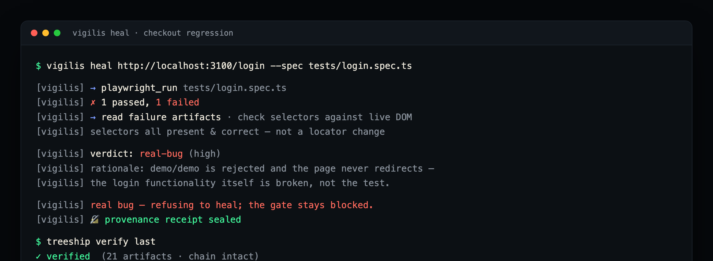

<h1 align="center">👁️ Vigilis</h1>

<p align="center"><b>The QA gate for AI-written code.</b><br/>
It heals safe test drift, <b>refuses real regressions</b>, and signs every decision into an independent, verifiable receipt.</p>

<p align="center">
<a href="https://www.npmjs.com/package/vigilis"></a>
<a href="./LICENSE"></a>
<a href="https://github.com/piyushpathakqa/Vigilis/actions/workflows/ci.yml"></a>
<a href="https://vigilis.dev"></a>
</p>

<p align="center"></p>

---

## The problem

Tell any coding agent to *"make CI pass"* and the cheapest path to green is **deleting the test that caught the bug.** AI now writes and fixes tests on its own — so the only question that matters is: **can you trust what it did?**

Vigilis answers it. Point it at the Playwright, Cypress, or Selenium suite you already have. When a test breaks, it decides:

- **Cosmetic drift** (a renamed selector) → it heals the locator, re-runs to verify green, opens a PR.
- **A real behaviour change** (checkout total went from `$49` to `$0`) → it **refuses to touch the test, fails the gate**, and surfaces the bug instead of burying it.

And **every decision is sealed into a signed, offline-verifiable receipt** by an independent notary — so a refusal is something you can *prove*, not just claim.

> Self-healing is the wedge. **Verifiable proof is the point.**

**Where teams point it:** gate AI-written code · self-heal without hiding bugs · auditable test runs · audit-grade evidence for SOX / payment controls · agent-native (MCP). → [see the use cases](https://vigilis.dev/use-cases)

## See it refuse a real bug



The agent ran the spec, saw it fail, checked that the selectors were all correct, concluded the app's login was genuinely broken, and **refused to heal** — then sealed a receipt anyone can verify offline.

## Quickstart

```bash
npm i -D vigilis                      # in your Playwright / Cypress / Selenium project
npx playwright install chromium       # one-time, for browser automation
export ANTHROPIC_API_KEY=sk-ant-...   # a pay-as-you-go API key (not a Claude.ai subscription)

npx vigilis init                                   # scaffold vigilis.config.json (auto-detects your framework)
npx vigilis generate https://your-app.com --run    # explore the app → write + run a real spec
npx vigilis heal https://your-app.com --spec tests/login.spec.ts   # heal drift → verify green → PR (refuses real bugs)
```

Runs in your CI on your own key + chromium. About **10¢ per run** on the fast model (`--model claude-haiku-4-5`); Opus by default for quality.

## Why it's different

| | Vigilis |
|---|---|
| **Heals** | Rewrites the locator for cosmetic drift, re-verifies green, opens a PR. |
| **Refuses** | A real regression is a hard, fail-closed contract — it will not weaken the assertion that caught the bug. |
| **Proves** | Every heal *and* every refusal is sealed into an independent, offline-verifiable receipt (via [Treeship](https://www.treeship.dev)). |

Attestation is **verifiable** and **auditable** — it proves *what the agent did*, in order, unaltered. It does **not** claim the agent's judgement was correct. That honesty is the point: Vigilis improves signal, it doesn't hide failures.

**Why a refusal is credible: no layer grades its own work.** The **actor** (any agent) writes the code and tests; **Vigilis** judges the behaviour and gates the deploy; an **independent notary** ([Treeship](https://www.treeship.dev)) signs the verdict. Vigilis never signs its own homework — which is what makes the proof worth anything to someone who doesn't already trust you.

## Optional: alert on a refusal

On a real-bug refusal, Vigilis can post a **Slack** alert and file a **deduplicated Linear** ticket — each linking the signed receipt. Off by default; a no-op until you set `SLACK_WEBHOOK_URL` / `LINEAR_API_KEY`. See [`docs/REFUSAL-ACTIONS.md`](./docs/REFUSAL-ACTIONS.md).

## Drive it from Claude (MCP)

The same tools ship as an **MCP server** ([`vigilis-mcp`](https://www.npmjs.com/package/vigilis-mcp), [in the official MCP registry](https://registry.modelcontextprotocol.io)) — generate / triage / heal straight from Claude Desktop, Claude Code, or Cursor. Add it to your MCP client config:

```json
{
  "mcpServers": {
    "vigilis": {
      "command": "npx",
      "args": ["-y", "vigilis-mcp"],
      "env": { "ANTHROPIC_API_KEY": "sk-ant-..." }
    }
  }
}
```

Full setup: [`docs/MCP.md`](./docs/MCP.md).

## Provenance receipts

When the [Treeship](https://www.treeship.dev) CLI is present, every `vigilis heal` run is sealed into a signed, offline-verifiable receipt automatically. No hard dependency; `--no-receipt` to opt out. Verify with `treeship verify last`. See [`docs/TREESHIP.md`](./docs/TREESHIP.md).

Without Treeship, `heal` falls back to a **local attestation** provider (zero secrets): a hash-chained, tamper-evident bundle written to `.vigilis/attestation/` — "N artifacts, chain intact (unsigned)". It's verifiable and auditable (it proves *what the agent did*, not that its judgment was correct); configure Treeship to upgrade it to a signed, independently-notarized receipt.

## Why I built this

I've spent my career in QA, and AI just rewrote the job: agents now write and fix tests on their own. Huge speed win — but it quietly breaks the one thing testing exists for. When an agent makes a red test green, did it *fix* the bug, or delete the test that caught it? At scale, nobody can check every change by hand.

So Vigilis isn't another self-healer — healing is becoming a commodity. It's the layer that decides **honestly** which failures to heal and which to refuse, and signs every call so you don't have to take its word for it.

The way I think about it: **git is a ledger of your code; Vigilis is a ledger of your agent's decisions** — proof you can hand to someone who doesn't already trust you.

— [Piyush](https://vigilis.dev)

---

## How it's built

Vigilis defines its QA tools **once** and exposes them **twice** — as an MCP server and as a CLI — over one Claude agent loop:

```
                     ┌──────────────────────────────┐
                     │   core                       │  Anthropic Messages API + tool use
                     │   Agent loop + Tool Registry │  browser · dom · fs · playwright · git
                     └───────┬───────────────┬──────┘
                ┌────────────▼──┐         ┌──▼───────────────┐
                │ vigilis-mcp   │         │ vigilis (CLI)    │
                │ MCP server    │         │ npx vigilis ...  │
                │ (Claude)      │         │ (used in CI)     │
                └───────────────┘         └──────────────────┘
```

The loop: **Generate** (explore a URL → write specs) → **Triage** (real-bug vs drift vs flake) → **Heal** (fix drift → verify green → PR, refuse real bugs). *Author* (plain-English intent → test plan) is on the roadmap.

### Repo layout

```
vigilis/
├─ packages/
│  ├─ core/   # agent loop, tool registry, Claude client, prompts, refusal actions
│  ├─ mcp/    # MCP server wrapping the registry
│  └─ cli/    # the `vigilis` command (generate | triage | heal)
├─ apps/
│  ├─ sample-shop/   # Next.js demo target (login + products + cart, with seeded drift/bug toggles)
│  ├─ cloud/         # governance cloud — org audit dashboard over signed receipts
│  └─ web/           # landing page → vigilis.dev
└─ tests/            # generated specs land here
```

### Develop

```bash
pnpm install
cp .env.example .env    # add ANTHROPIC_API_KEY
pnpm build && pnpm test
```

Watch the full loop against the bundled demo app — see [`docs/DEMO.md`](./docs/DEMO.md).

## Roadmap

- ✅ Generate · Triage · Heal (Playwright, Cypress & Selenium — all live-verified)
- ✅ GitHub Actions QA gate · signed provenance receipts · MCP server
- ✅ Refusal actions (Slack + Linear) · governance-cloud audit dashboard
- 🚧 Author (intent → test plan) · broader agent-attestation surface

## Credits

Provenance receipts are powered by **[Treeship](https://www.treeship.dev)** — the independent attestation primitive — and governed memory by **ZMem**, both built by **Zerker Labs**. Thanks to the Zerker Labs team for the trust primitives Vigilis stands on.

## License

[MIT](./LICENSE) © Piyush Pathak
